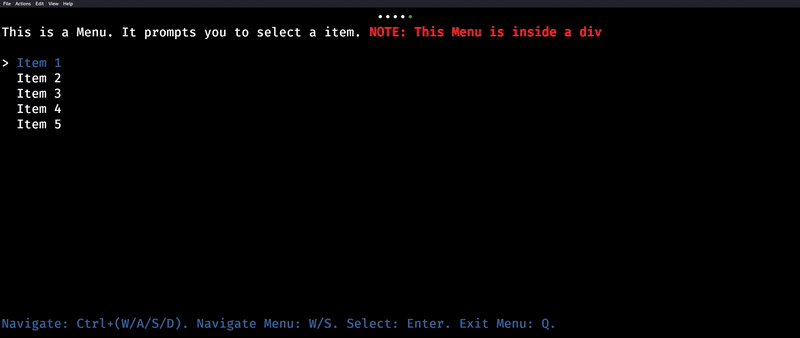

<div style="text-align: center;">
    
    <h1>A Component-based TUI library written in Go</h1>
    
</div>


# Hello World
```go
package main

import (
	"github.com/orus-dev/osui"
	"github.com/orus-dev/osui/ui"
)

func main() {
    app := ui.Div(
        ui.Text("Hello, World!")
    )

    screen := osui.NewScreen(app)
    screen.Run()
}
```

# [Documentation](https://github.com/orus-dev/osui/wiki)
